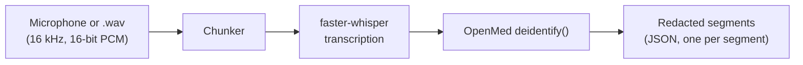
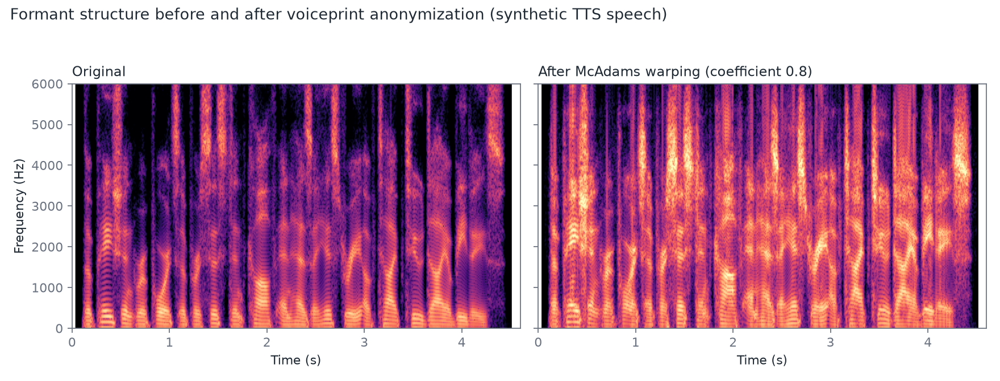
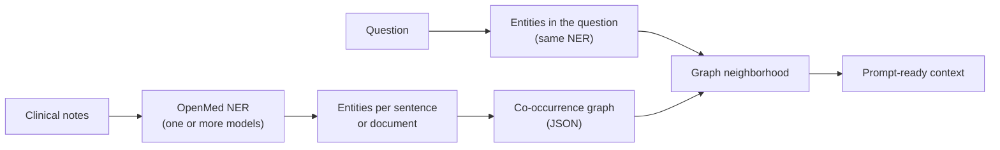
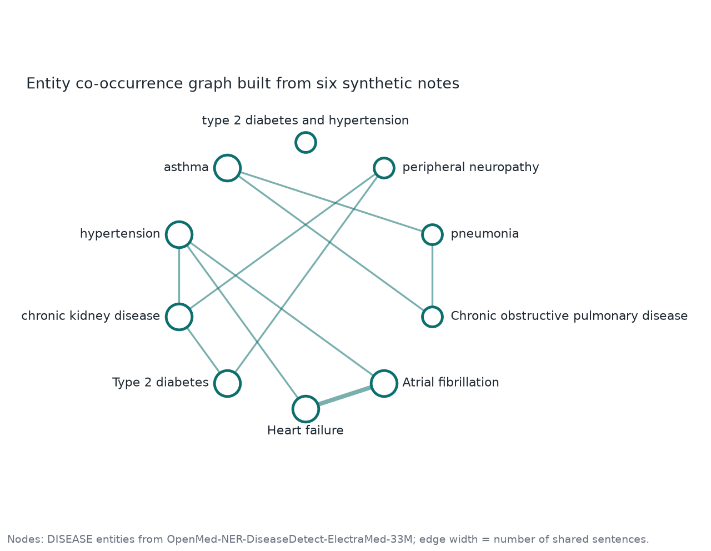

<div align="center">

<h1>openmed-ambient-graph</h1>

<p><b>Ambient speech redaction, voiceprint anonymization, and local GraphRAG for clinical text.</b></p>

<p>
  Built on <a href="https://github.com/maziyarpanahi/openmed">OpenMed</a> ·
  <a href="../LICENSE">Apache-2.0</a> ·
  Python 3.10+
</p>

</div>

> [!NOTE]
> This project extends the [OpenMed](https://github.com/maziyarpanahi/openmed) SDK (Apache-2.0) and is maintained independently by [Hossein Hooshmand](https://github.com/Hussmart). It is not affiliated with or endorsed by the OpenMed maintainers. The modules, CLI commands, and extras described here are new in this repository; the rest of the tree is upstream OpenMed, and its own README is still at [`README.md`](https://github.com/Hussmart/openmed-ambient-graph/blob/master/README.md).

## Why

De-identifying a transcript is only half of protecting a clinical conversation.

- **The recording is still identifying.** HIPAA's Safe Harbor list names voice prints as an identifier, so a redacted transcript next to an untouched audio file leaves the speaker identifiable.
- **Redaction is cheapest at the moment of speech.** Redacting each segment as it is transcribed means raw PHI never has to sit in a note or log.
- **LLM answers about a corpus can invent relationships.** Grounding a question in relationships that were actually observed in your documents gives the model something checkable instead.

This project adds one tool for each of these, on top of OpenMed's NER models and `deidentify()` engine.

## What it adds

| Capability | What it does | Code |
| --- | --- | --- |
| **Ambient speech redaction** | Streams microphone or `.wav` audio through local [`faster-whisper`](https://github.com/SYSTRAN/faster-whisper) transcription, then through OpenMed's `deidentify()`, one segment at a time | [`openmed/ambient/`](../openmed/ambient/) |
| **Voiceprint anonymization** | Warps a recording's formant structure with McAdams-coefficient LPC pole warping, so the audio itself is altered; pure NumPy, no model download | [`openmed/ambient/voice_privacy.py`](../openmed/ambient/voice_privacy.py) |
| **Local entity graph** | Builds a weighted co-occurrence graph from OpenMed NER output, per sentence or per document, saved as plain JSON | [`openmed/graph/builder.py`](../openmed/graph/builder.py) |
| **GraphRAG retrieval** | Turns a question into prompt-ready context from the relationships observed in your corpus | [`openmed/graph/retrieval.py`](../openmed/graph/retrieval.py) |

It also adds three optional extras (`speech`, `mic`, `voice-privacy`) and two Typer CLI command groups (`ambient`, `graph`).

## Quick start

```bash
git clone https://github.com/Hussmart/openmed-ambient-graph
cd openmed-ambient-graph
pip install -e ".[hf,cli,speech,mic,voice-privacy]"
```

The first run downloads models from Hugging Face: `faster-whisper` `small.en` (about 0.5 GB) and OpenMed's default PII model (about 0.6 GB). After that everything runs locally. The commands are in the Typer CLI, so run them as `python -m openmed.cli.typer_app <group> ...`.

## Ambient speech redaction



```bash
# A recorded encounter
python -m openmed.cli.typer_app ambient file visit.wav --model small.en

# Live microphone
python -m openmed.cli.typer_app ambient mic --model small.en
```

```python
from openmed.ambient import AmbientRedactionPipeline, WavFileAudioSource

pipeline = AmbientRedactionPipeline(model_size="small.en")
for redacted in pipeline.stream(WavFileAudioSource("visit.wav")):
    print(redacted.segment.start, redacted.redacted_text)
```

No PII heuristics live in this module. Every redaction decision is delegated to OpenMed's `deidentify()`, so behavior and thresholds match the rest of the SDK. Segment times are offsets from the start of the stream.

On a synthetic 5.2-second clip, transcription with `small.en` returned "The patient reports a persistent cough and has a history of type 2 diabetes." at 0.0 to 4.4 s.

## Voiceprint anonymization

<div align="center">
  
</div>

For each 20 ms frame the anonymizer fits an all-pole LPC model, keeps the excitation (which carries pitch and timing), moves each pole's phase angle to the power of the McAdams coefficient, and re-synthesizes. That shifts the formant structure, the main correlate of perceived speaker identity, while leaving the speech intelligible.

```bash
python -m openmed.cli.typer_app ambient anonymize-voice visit.wav visit_anonymized.wav --mcadams 0.8
```

```python
from openmed.ambient import anonymize_wav_file

anonymize_wav_file("visit.wav", "visit_anonymized.wav", mcadams_coefficient=0.8)
```

The coefficient must be in (0, 1.5]; values further from 1.0 warp more. The method is a lightweight research baseline (Patino et al., Interspeech 2021, and the VoicePrivacy Challenge baselines), not a guarantee of anonymity; see [Limits](#limits).

## Local entity graph and GraphRAG



<div align="center">
  
</div>

```bash
python -m openmed.cli.typer_app graph build note1.txt note2.txt --output graph.json \
  --models OpenMed/OpenMed-NER-DiseaseDetect-ElectraMed-33M --window sentence --threshold 0.3

python -m openmed.cli.typer_app graph query "Does the patient with asthma have any other conditions?" \
  --graph graph.json --models OpenMed/OpenMed-NER-DiseaseDetect-ElectraMed-33M
```

```python
from openmed.graph import build_entity_graph, GraphRAGRetriever

models = ["OpenMed/OpenMed-NER-DiseaseDetect-ElectraMed-33M"]
graph = build_entity_graph({"note-1": text}, model_names=models, cooccurrence_window="sentence")
context = GraphRAGRetriever(graph, model_names=models).retrieve("Does the patient with asthma have any other conditions?")
print(context.context_text)
```

`sentence` links only entities that share a sentence (precise, sparse); `document` links every pair in a document. A single-type model such as the disease model above needs several diseases per sentence, or several models, to produce edges. The saved JSON keeps document counts but not document ids, so a shared graph does not reveal which records contributed to a relationship.

The graph shown above came from a real run of that model over six short synthetic notes: 10 entities and 10 edges.

## Verification

- 49 unit tests cover the new modules: `pytest tests/unit/ambient tests/unit/graph`.
- Real models were exercised locally: `faster-whisper` `small.en` for transcription, `OpenMed-NER-DiseaseDetect-ElectraMed-33M` for the graph, and voice anonymization on synthetic speech (the figure above).
- The whole path from audio through de-identification has not been run end to end with a real PII model; the unit tests mock that stage.

## Limits

- There is no consent, capture-state, audio-retention, or speaker-role handling. Do not point the ambient pipeline at real patient audio without your own controls.
- McAdams warping reduces speaker identifiability but has not been evaluated against speaker-verification systems and gives no anonymity guarantee.
- The graph records co-occurrence, not typed clinical relations such as "treats" or "causes". Edges are candidates to verify, not facts.
- None of this by itself establishes HIPAA or any other compliance.

## Relationship to OpenMed

- **From OpenMed, unchanged:** the NER and PII models, `deidentify()`, the model registry, the REST service, the mobile and browser kits, and the documentation. See the [upstream README](https://github.com/Hussmart/openmed-ambient-graph/blob/master/README.md) and [openmed.life/docs](https://openmed.life/docs).
- **New here:** everything in the table above, plus the tests in `tests/unit/ambient/` and `tests/unit/graph/`.
- **Upstream files modified:** `pyproject.toml` (three extras), `openmed/cli/typer_app.py` (two command groups), `openmed/core/capabilities.py` (three backend entries), `docs/security/license-inventory.md` and `tests/unit/licenses/test_inventory.py` (two new dependencies).
- **Fork point:** upstream commit `b161a18f`.
- **Upstream roadmap:** OpenMed tracks its own ambient work in [its issue #3194](https://github.com/maziyarpanahi/openmed/issues/3194). This repository is a separate implementation and is not part of that plan.

## Development

```bash
pip install -e ".[dev]"
pytest tests/unit/ambient tests/unit/graph
ruff check openmed/ambient openmed/graph
```

## Security

Never include real patient data in a report. For a vulnerability in the code added here (`openmed/ambient/`, `openmed/graph/`), use this repository's [private vulnerability reporting](https://github.com/Hussmart/openmed-ambient-graph/security/advisories/new). For upstream code, follow the upstream project's [security policy](https://github.com/maziyarpanahi/openmed/blob/master/SECURITY.md).

## Credits and references

- **[OpenMed](https://github.com/maziyarpanahi/openmed)** by Maziyar Panahi and contributors: the SDK, models, and `deidentify()` engine this project builds on.
- **[faster-whisper](https://github.com/SYSTRAN/faster-whisper)** (SYSTRAN), built on CTranslate2 and OpenAI Whisper, for transcription.
- **J. Patino, N. Tomashenko, M. Todisco, A. Nautsch, N. Evans**, "Speaker anonymisation using the McAdams coefficient", Interspeech 2021, and the VoicePrivacy Challenge baselines, for the anonymization method.
- **Hugging Face**, **NumPy**, and **sounddevice**.

## License

Apache-2.0. See [LICENSE](../LICENSE) and [NOTICE](../NOTICE); third-party notices are unchanged from upstream.

## Citation

If you use OpenMed's models or SDK, cite the upstream paper:

```bibtex
@misc{panahi2025openmedneropensourcedomainadapted,
      title={OpenMed NER: Open-Source, Domain-Adapted State-of-the-Art Transformers for Biomedical NER Across 12 Public Datasets},
      author={Maziyar Panahi},
      year={2025},
      eprint={2508.01630},
      archivePrefix={arXiv},
      primaryClass={cs.CL},
      url={https://arxiv.org/abs/2508.01630},
}
```

## Author

[Hossein Hooshmand](https://github.com/Hussmart)
